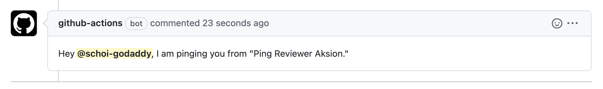

# Ping-Reviewer-Aksion

Github action to ping reviewer when PR is made. PLEASE DO NOT USE THIS - This package is for demo purpose.



## Environment Variables

## `GITHUB_TOKEN`

**Required** The github token to create comment on a PR.

## Inputs

## `who-to-ping`

**Required** The username of the person to ping **without** `@`. Default `"NULL"`.
ex) `schoi-godaddy`

## Outputs

## `time`

The time we pinged the person.

## Example usage

```yaml
name: "Ping someone in the comment"

on:
  pull_request:
    types:
      - opened
      - reopened

jobs:
  main:
    name: Ping someone in the comment section of PR
    runs-on: ubuntu-latest
    steps:
      - uses: schoi-godaddy/ping-reviewer-aksion@v1.0
        env:
          GITHUB_TOKEN: ${{ secrets.GITHUB_TOKEN }}
        with:
          who-to-ping: "schoi-godaddy"
```
